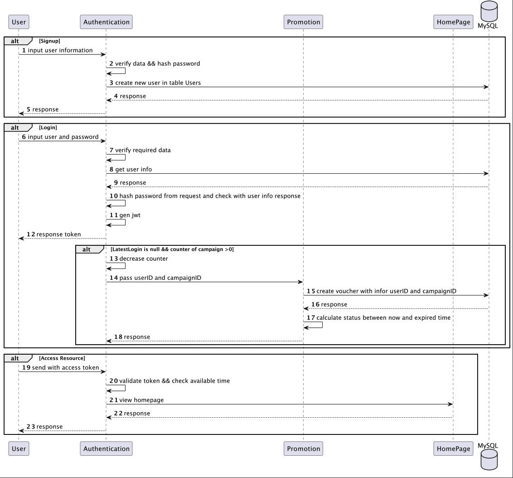
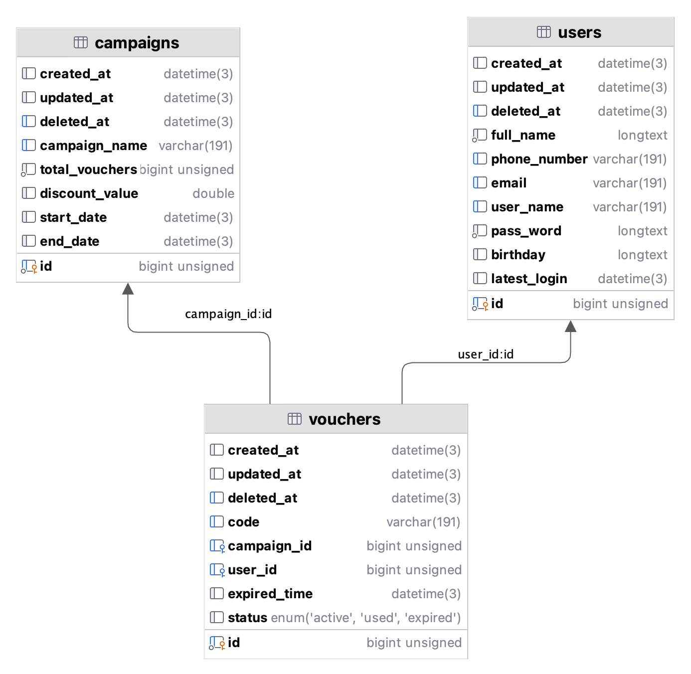

# Promotion System

This repository contains the codes of the Authentication System and Promotion System.
Require:
+ User login with account and password, account is username or email or phone number
+ Register a profile: full name, phone number, email, user name, password, birthday, latest login and 3 of them can not null
+ Support 100 first login user per campaign when client register a new account on system will get 30% discount voucher 

Feature:
+ Sign in 
  + Store information includes full name, phone number, email, username, pass word, birthday, latest login
  + Pass word hashed by bcrypt
+ Log in
  + With one of phone number, email or username and password 
  + Response jwt token and give token in header to pass dashboard
+ Access resource 
  + With /homepage to use middleware for authentication (*check /api/user.http for request*) 
+ Add voucher for user if user login the first time and based on campaigns
  + Number of users received voucher will be limited by total_vouchers(campaigns)
  + Use latest_login is nil to check user login the first time

Usage:
+ Use counter to keep consistent variable counter avoid dirty read, and control for total participants of campaigns 
+ Use pipeline to pass userid to create voucher, reduce database hits continuous

Plan:
+ Use memcached or redis to store counter data
+ Use other broker queue such as gg pub/sub, kafka instead of
+ Separate monolith to microservice with authentication service, promotion, and more...

### Sequence 

### Database

+ Status is in active, used, expired to get status voucher of user and show in app list voucher user owner with its status if necessary.

### Setup infrastructure
+ Run MySQL by docker-compose with init by file sql/init.sql[dataium_trigger_push_file.puml](..%2F..%2F..%2F..%2F..%2FDesktop%2Fuml%2Fdataium_trigger_push_file.puml)
  
        docker-compose up -d
+ Add environment to get config from file

        CONFIG_PATH=config/local.yaml
+ Run go project
  
        go build -o authen-system